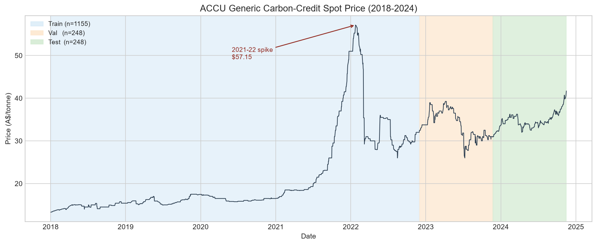
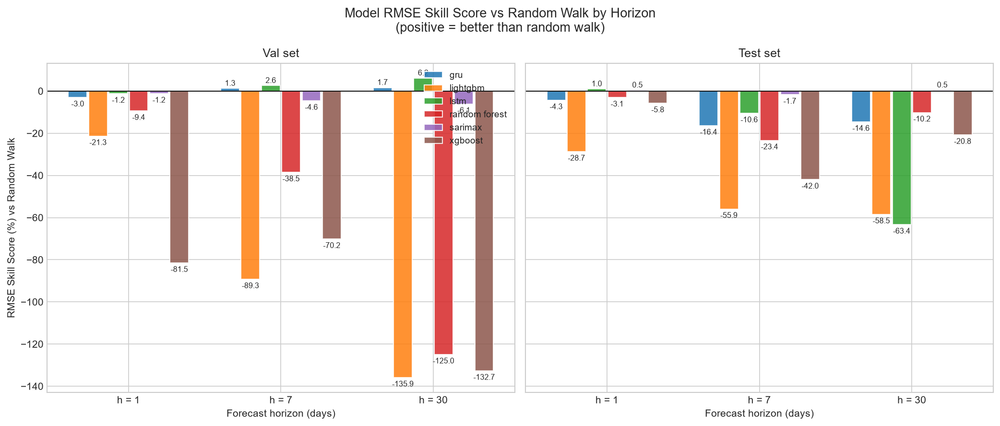
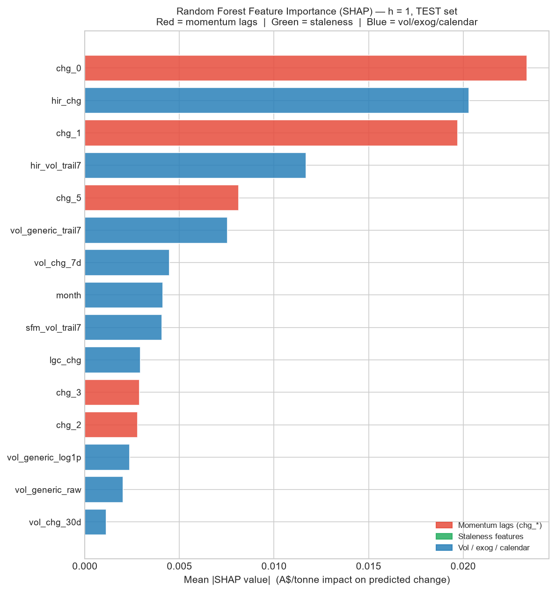

# Australian Carbon Credit Price Forecasting

**Can machine learning beat a random walk on ACCU Generic spot prices?**
A rigorous time-series study at 1, 7, and 30-day horizons — with an honest answer.

---

## The Question

Australian Carbon Credit Units (ACCUs) are traded instruments representing one tonne of CO₂-equivalent
abated under government-registered emissions reduction methods. The ACCU Generic spot price is the
benchmark market price.

This study asks two questions:
1. Can any model — tree-based, classical, or deep learning — generate statistically significant
   forecast improvements over a naive random-walk baseline at 1-, 7-, and 30-day horizons?
2. What features, if any, drive the model's decisions, and are they economically meaningful?

---

## Key Finding

**No model significantly beats the random walk at any horizon.**

Six candidate models were evaluated on a held-out chronological test set (2023–2024):
Random Forest, XGBoost, LightGBM, SARIMAX, LSTM, and GRU.
Using the Diebold-Mariano test with Harvey-Leybourne-Newbold small-sample correction,
no model achieves a statistically significant improvement over the random-walk benchmark
(all p-values > 0.05 for the "better than RW" hypothesis).
Several models are **significantly worse** than the random walk at h = 7 days.

Why? The ACCU spot price is I(1) — any trained model faces the same null as the random walk.
Critically, **~75% of trading days in the training set are stale**: the price does not change,
because no trade occurred. A faint directional signal (~60% accuracy on genuine-move days at h = 1)
exists, but is insufficient to overcome forecast error on the remaining days.

SHAP analysis of the best tree model (Random Forest, h = 1) reveals that the apparent marginal
skill comes from **regime detection** — identifying stale vs active market days — not from
directional price forecasting. Because the random walk also predicts zero change, it is
effectively doing the same thing.

This is the credible, defensible result for a near-efficient, event-driven market.

---

## Figures

<p align="center">
  
  <br><em>ACCU Generic price 2018–2024. Training (blue) / validation (orange) / test (green) splits.
  The 2021–22 policy-driven spike dominates the training regime; the test set is a calmer plateau.</em>
</p>

<p align="center">
  
  <br><em>RMSE skill score (%) vs random walk for all models and horizons. Bars above zero = better than
  RW. No model achieves a consistent positive edge; several are significantly worse at h = 7 days.</em>
</p>

<p align="center">
  
  <br><em>SHAP feature importance for Random Forest (h = 1, test set). Red = momentum lags;
  green = staleness features; blue = volume / exogenous / calendar. The model primarily
  learns market-regime context, not directional price signals.</em>
</p>

---

## Methodology

**What makes this study defensible:**

| Decision | Why |
|----------|-----|
| Model price *changes*, not levels | The price level is I(1); changes are stationary and regime-stable |
| Feature audit before any modelling | Exclude target-derived columns ($ change, WoW %, YTD), sibling price levels, and premium-over-Generic columns — all introduce leakage or level-reconstruction artefacts |
| Staleness-aware features | 75% stale days in training; the feature matrix explicitly encodes `days_since_last_move`, `moves_7d/30d`, and `price_moved` |
| Chronological 70 / 15 / 15 split | No shuffling at any stage; train → val → test in strict time order |
| Train-only scaling and imputation | StandardScaler and forward-fill fit on training rows only; never applied backwards |
| Walk-forward CV (TimeSeriesSplit) | Never random k-fold; every tuning fold ends strictly before its validation fold |
| Skill score vs random walk | Primary metric: 100 × (1 − RMSE_model / RMSE_RW) in % — positive means better |
| Diebold-Mariano significance | HAC long-run variance (Newey-West, Bartlett kernel), HLN small-sample correction, t(T−1) distribution |
| SHAP TreeExplainer | Exact additive attributions for the best tree model; verified by test suite (additivity to 1e-4) |

---

## Repository Structure

```
.
├── src/
│   ├── data_cleaning.py    # cleaning pipeline (load, strip, drop, ffill, split, save parquet)
│   ├── features.py         # leakage-free feature construction (lags, staleness, volatility, exog diffs)
│   ├── baselines.py        # random-walk and drift forecasts
│   ├── evaluate.py         # metrics: RMSE, MAE, MAPE, directional accuracy, skill score
│   ├── models.py           # RF, XGBoost, LightGBM, SARIMAX with walk-forward tuning
│   ├── dl_models.py        # LSTM and GRU in PyTorch (sequence construction, early stopping)
│   ├── significance.py     # Diebold-Mariano test (HAC + HLN), directional accuracy on move-days
│   ├── explain.py          # SHAP TreeExplainer for RF h=1 (summary + dependence figures)
│   ├── eda.py              # stationarity tests, ACF/staleness figures, error-regime plots
│   └── report.py           # python-docx section builders (Sections 1–11)
├── scripts/
│   ├── run_cleaning.py     # produce train/val/test parquet files
│   ├── run_eda.py          # generate EDA figures only
│   ├── run_models.py       # standalone ML/DL model runner
│   └── build_report.py     # full end-to-end pipeline → Statistical_Report.docx/.pdf
├── tests/                  # 150 pytest tests across all modules
├── figures/                # generated plots (key figures committed; others git-ignored)
├── data/
│   ├── raw/                # raw CSV (git-ignored)
│   └── processed/          # cleaned parquet splits (git-ignored)
├── Statistical_Report.pdf  # full write-up (11 sections)
├── Statistical_Report.docx
├── requirements.txt
└── pytest.ini
```

---

## How to Run

```bash
# 1. Install dependencies (Python 3.10+)
pip install -r requirements.txt

# 2. Place the raw data file at data/raw/raw_20241118.csv

# 3. Clean and split the data
python scripts/run_cleaning.py

# 4. Run the full pipeline (features → models → DL → significance → SHAP → report)
python scripts/build_report.py
# Produces Statistical_Report.docx and Statistical_Report.pdf at the repo root.

# 5. Run the test suite
pytest
# Expected: 150 passed
```

> **Note:** `build_report.py` runs all models end-to-end and takes ~10–15 minutes
> (dominated by DL training). `scripts/run_models.py` runs only the ML models if faster iteration is needed.

---

## Report

The full write-up — 11 sections covering data cleaning, EDA, feature engineering,
baseline definitions, modelling results, DL results, Diebold-Mariano significance tests,
SHAP explainability, limitations, and conclusion — is available at:

**[Statistical_Report.pdf](Statistical_Report.pdf)**

---

## Tech Stack

| Category | Libraries |
|----------|-----------|
| Data | `pandas`, `numpy`, `pyarrow` |
| ML | `scikit-learn`, `xgboost`, `lightgbm` |
| Classical stats | `statsmodels` (SARIMAX, ADF, KPSS) |
| Deep learning | `torch` (PyTorch) |
| Explainability | `shap` |
| Visualisation | `matplotlib`, `seaborn` |
| Reporting | `python-docx`, `docx2pdf` |
| Testing | `pytest` |

---

## License

MIT — see [LICENSE](LICENSE).
